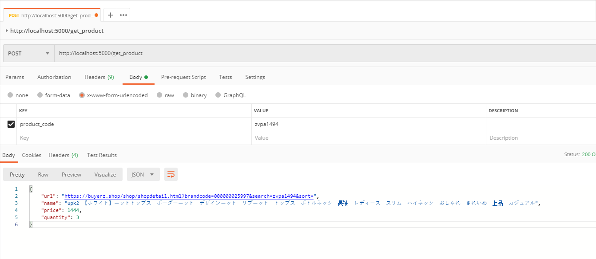

# Python Flask-based Restful API Example
A python flask-based api to fetch its details scraped by product code in one example shop site.

## Screenshots

| Log In | Create an account | Authorized page |
| -------|--------------|-----------------|
|  |

## Running

Just run this command:

```
python api.py
```